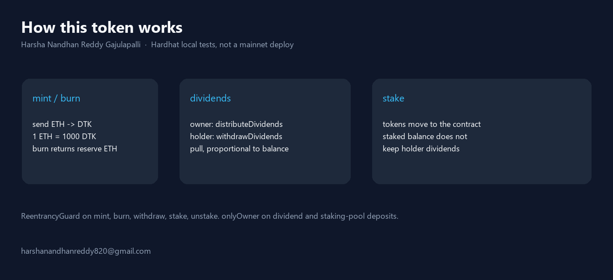
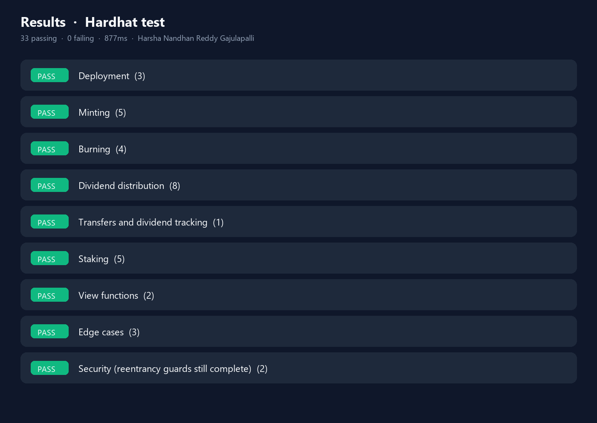

# Dividend Token

Mintable ERC-20 (`DTK`). Send ETH to `mint` (1 ETH = 1000 DTK). The owner can send extra ETH with `distributeDividends`; holders pull their share with `withdrawDividends`. `burn` returns a slice of the ETH reserve. `stake` moves tokens to the contract (staked tokens do **not** keep earning holder dividends).

`ReentrancyGuard` on mint / burn / withdraw / stake / unstake. `onlyOwner` on `distributeDividends` and `fundStakingRewards`.

This is a **lab contract**. It is not a professional audit and it was **not** deployed to a public network in this run.

Author: **Harsha Nandhan Reddy Gajulapalli**  
Email: **harshanandhanreddy820@gmail.com**  
GitHub: [Harshanandhan](https://github.com/Harshanandhan)



## Run

```bash
npm install
npx hardhat test
python render_images.py
```

## Results

`npx hardhat test` on the local Hardhat network, Solidity 0.8.24, 2026-08-27.

**33 passing, 0 failing, 877ms.**



| Group | Tests | Result |
|---|---:|---|
| Deployment | 3 | pass |
| Minting | 5 | pass |
| Burning | 4 | pass |
| Dividend distribution | 8 | pass |
| Transfers and dividend tracking | 1 | pass |
| Staking | 5 | pass |
| View functions | 2 | pass |
| Edge cases | 3 | pass |
| Security (reentrancy guards still complete) | 2 | pass |

One assertion was wrong: after staking 300 of 1000 tokens, it expected the holder to still get 0.7 ETH of a 0.7 ETH distribution. The contract pays **0.49 ETH** (700/1000) because `stake` transfers tokens to the contract. The test now checks 0.49 ETH.

The two "Security" tests only check that `burn` / `withdrawDividends` finish. They are not an exploit suite.

JSON: `results/tests.json`. Full log: `results/test-output.txt`.

No private key was used. No testnet tx.

## Layout

```
contracts/DividendToken.sol   mint / burn / dividends / stake
test/DividendToken.test.js    33 Hardhat tests
ignition/modules/DividendToken.js   local Hardhat Ignition module
results/                      log + JSON from the run above
images/                       diagrams built from that JSON
render_images.py              rebuilds the PNGs from results/tests.json
```

## License

MIT. Copyright (c) 2026 Harsha Nandhan Reddy Gajulapalli.
